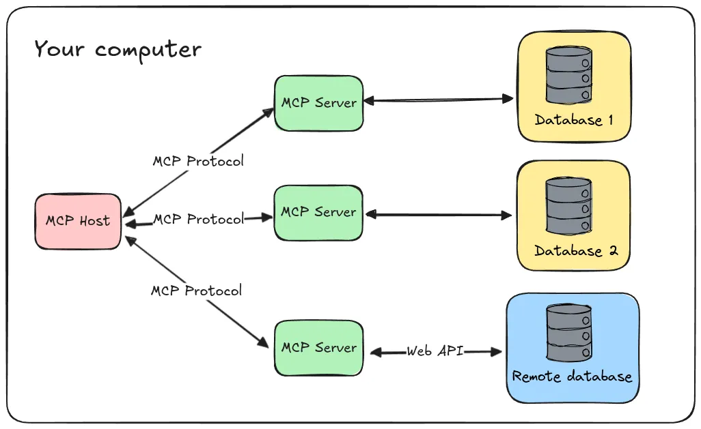
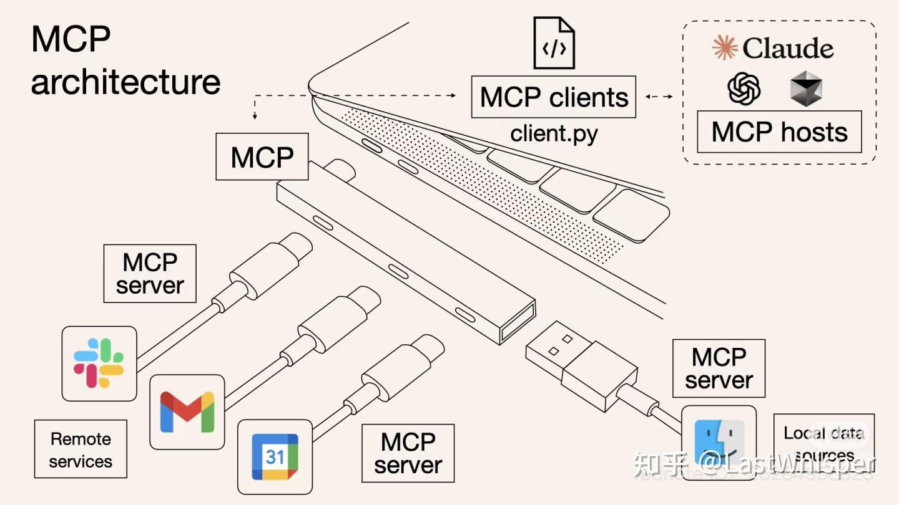

# MCP（Model Context Protocol）通信协议与使用指南笔记

---

## 一、MCP 概述

MCP（Model Context Protocol，模型上下文协议）是由 Anthropic 于 2024 年 11 月推出的开放标准，旨在规范大型语言模型（LLM）与外部数据源、工具和服务之间的交互方式。
MCP 的核心理念是将 AI 模型与外部世界连接，使其能够访问实时数据、调用外部工具并执行操作，从而提升模型的实用性和自动化能力。MCP 是一个开放协议，它为应用程序向 LLM 提供上下文的方式进行了标准化。你可以将 MCP 想象成 AI 应用程序的 USB-C 接口。就像 USB-C 为设备连接各种外设和配件提供了标准化的方式一样，MCP 为 AI 模型连接各种数据源和工具提供了标准化的接口。

### 为什么选择 MCP？
- MCP 帮助你在 LLM 的基础上构建代理（agents）和复杂的工作流。LLM 经常需要与数据和工具集成，而 MCP 提供了：
- 持续增长的预构建集成列表，LLM 可直接使用
- 灵活切换不同的 LLM 提供商和厂商
- 在你的基础设施内安全地处理数据的最佳实践

### 通用架构
MCP 核心采用客户端-服务器架构，主机应用可以连接多个服务器：

你可以将 MCP 想象成 AI 应用程序的 USB-C 接口。就像 USB-C 为设备连接各种外设和配件提供了标准化的方式一样，MCP 为 AI 模型连接各种数据源和工具提供了标准化的接口。


- MCP Hosts: 如 Claude Desktop、IDE 或 AI 工具，希望通过 MCP 访问数据的程序
- MCP Clients: 维护与服务器一对一连接的协议客户端
- MCP Servers: 轻量级程序，通过标准的 Model Context Protocol 提供特定能力
- 本地数据源: MCP 服务器可安全访问的计算机文件、数据库和服务
- 远程服务: MCP 服务器可连接的互联网上的外部系统（如通过 APIs）

---

## 二、通信机制

Model Context Protocol (MCP) 中的传输层为 clients 和 servers 之间的通信提供基础。传输层处理消息发送和接收的底层机制。MCP 支持多种通信机制，以适应不同的部署场景：

### 消息格式
MCP 使用 JSON-RPC 2.0 作为其传输格式。传输层负责将 MCP 协议消息转换为 JSON-RPC 格式进行传输，并将接收到的 JSON-RPC 消息转换回 MCP 协议消息。
使用的 JSON-RPC 消息有三种类型：
​
#### 请求
```json
{
  jsonrpc: "2.0",
  id: number | string,
  method: string,
  params?: object
}
```
#### 响应
```json
{
  jsonrpc: "2.0",
  id: number | string,
  result?: object,
  error?: {
    code: number,
    message: string,
    data?: unknown
  }
}
```
#### 通知
```json
{
  jsonrpc: "2.0",
  method: string,
  params?: object
}
```
1. **标准输入输出（Stdio）**：适用于本地通信，客户端通过启动一个子进程（MCP Server），并通过其 stdin 和 stdout 进行 JSON-RPC 通信。
stdio 传输通过标准输入和输出流进行通信。这对于本地集成和命令行工具特别有用。
在以下情况下使用 stdio：
构建命令行工具
实现本地集成
需要简单的进程通信
使用 shell 脚本
```typescript
//server
const server = new Server({
  name: "example-server",
  version: "1.0.0"
}, {
  capabilities: {}
});

const transport = new StdioServerTransport();
await server.connect(transport);
```
```typescript
//client
const client = new Client({
  name: "example-client",
  version: "1.0.0"
}, {
  capabilities: {}
});

const transport = new StdioClientTransport({
  command: "./server",
  args: ["--option", "value"]
});
await client.connect(transport);
```
2. **HTTP with SSE（Server-Sent Events）(将被弃用)**：适用于远程通信，服务器通过 HTTP 协议向客户端推送事件，客户端通过事件源（EventSource）接收数据。

3. **Streamable HTTP**：这是 MCP 规范中最新、最推荐的 HTTP 模式，通过一系列的 GET 和 POST 请求实现了一个可恢复的、无状态的会话管理机制，非常适合构建可扩展、高可用的网络服务。

这些通信机制确保了客户端与服务器之间的高效、可靠的双向通信。

---

## 三、官方 SDK 应用示例

MCP 官方提供了多种语言的 SDK，方便开发者构建客户端和服务器。以下是一个使用 TypeScript 的客户端示例：
```typescript
import { McpServer, ResourceTemplate } from "@modelcontextprotocol/sdk/server/mcp.js";
import { StdioServerTransport } from "@modelcontextprotocol/sdk/server/stdio.js";
import { z } from "zod";

const server = new McpServer({
  name: "demo-server",
  version: "1.0.0"
});

// ✅ 正确的 schema 写法
server.registerTool(
  "add",
  {
    title: "Addition Tool",
    description: "Add two numbers",
    inputSchema: {
      a: z.number(),
      b: z.number()
    }
  },
  async ({ a, b }) => {
    console.log(`Received add request: ${a} + ${b}`);
    return {
      content: [{ type: "text", text: String(a + b) }]
    };
  }
);

server.registerResource(
  "greeting",
  new ResourceTemplate("greeting://{name}"),
  { 
    title: "Greeting Resource",
    description: "Dynamic greeting generator"
  },
  async (uri, { name }) => {
    console.log(`Received greeting request for: ${name}`);
    return {
      contents: [{
        uri: uri.href,
        text: `Hello, ${name}!`
      }]
    };
  }
);

console.log("MCP Server starting...");
const transport = new StdioServerTransport();
await server.connect(transport);
console.log("MCP Server connected and ready");

```
```typescript
//client.js
import { Client } from "@modelcontextprotocol/sdk/client/index.js";
import { StdioClientTransport } from "@modelcontextprotocol/sdk/client/stdio.js";

async function main() {
  // 建立 transport，自动启动 server
  const transport = new StdioClientTransport({
    command: "node",
    args: ["dist/server.js"]
  });

  const client = new Client({
    name: "demo-client",
    version: "1.0.0"
  });

  await client.connect(transport);
  console.log("✅ Client connected to server");

  // 调用工具
  const result = await client.callTool("add", { a: 3, b: 5 });
  console.log("add(3,5) =>", result.content[0].text);

  // 获取资源
  const resource = await client.readResource("greeting://Alice");
  console.log("greeting://Alice =>", resource.contents[0].text);

  await client.close();
}

main().catch(console.error);

```
