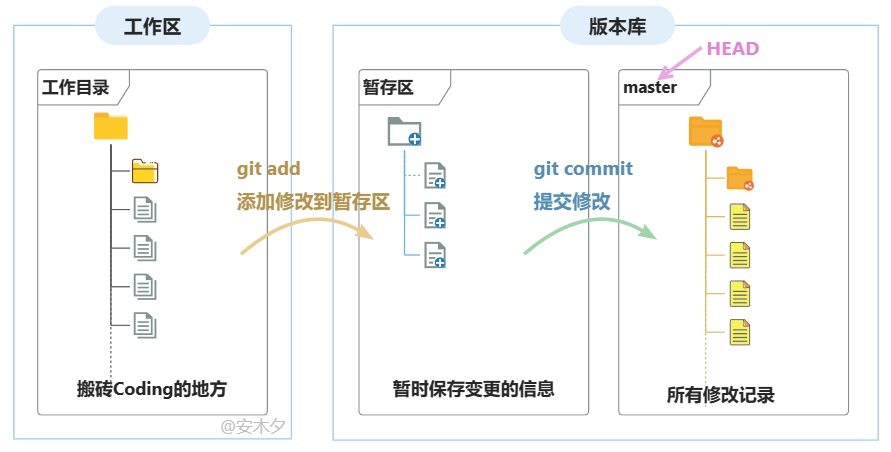
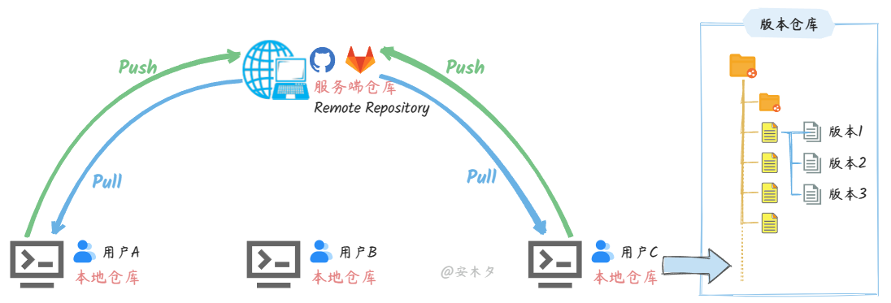

# Git 学习笔记

## 1. Git 基础概念

### 1.1 什么是 Git？

* **Git** 是一个 **分布式版本控制系统（DVCS）**，用于记录文件的修改历史，方便回退、对比和团队协作。
* 类比：写论文时保存了很多版本的文件，Git 就是自动帮你管理这些版本的“时间机器”。

与集中式版本控制（如 SVN）的区别：

* **SVN**：服务器保存历史，本地只有工作拷贝 → 离线几乎无法操作。
* **Git**：每个开发者的本地仓库都有完整历史，可离线查看、切换分支、提交修改。

---

### 1.2 Git 的四个核心区域

1. **工作区（Working Directory）**：你看到和编辑的代码文件所在目录。
2. **暂存区（Staging Area / Index）**：临时存放“下次要提交的改动”的区域，通过 `git add` 操作。
3. **本地仓库（Local Repository）**：存放完整历史记录，`git commit` 把暂存区内容存进本地仓库。
4. **远程仓库（Remote Repository）**：GitHub/GitLab 上的仓库，团队协作使用，`git push` 用于同步。

关系图：

```
工作区 → git add → 暂存区 → git commit → 本地仓库 → git push → 远程仓库
```

---

### 1.3 Git 对象模型

* **Blob**：文件内容
* **Tree**：目录结构，指向若干 Blob
* **Commit**：一次提交，指向一个 Tree 和上一个 Commit

每次提交都是“文件快照 + 修改历史链条”。

---

### 1.4 提交（Commit）

* 每次 commit 有唯一 **SHA-1 哈希值**
* 记录：提交人、提交时间、提交说明、指向前一次 commit 的指针
* 类比：提交历史像火车轨道，每节车厢是 commit，指针连接历史。

---

### 1.5 分支（Branch）

* 分支是指向 commit 的指针
* 默认分支是 `main`
* 创建新分支就是新建一个指针指向某个提交
* 类比：写小说时从第 10 章拉出新分支写不同结局

---

### 1.6 HEAD 指针

* HEAD 始终指向当前所在分支
* `git checkout dev` → HEAD 指向 dev
* 直接 checkout commit → 游离 HEAD（detached HEAD）

---

### 1.7 远程仓库（Remote）

* 本地仓库的副本，用于团队协作
* 常见远程仓库命名：

  * `origin` → 默认远程
  * `upstream` → 上游仓库
* 常用命令：

```bash
git remote -v
git remote add origin <url>
```

---

### 1.8 Git 工作流

1. **个人项目**：main 分支开发，commit → push
2. **小团队（GitHub Flow）**：功能分支 → 开发 → PR → 合并 main
3. **大团队（Git Flow）**：`main` / `develop` / `feature/` / `release/` / `hotfix/`

---

## 2. Git 常用命令

### 2.1 初始化与克隆

```bash
git init                         # 初始化本地仓库
git clone https://github.com/user/repo.git   # 克隆远程仓库
```

### 2.2 基本操作

```bash
git status                        # 查看状态
git add filename                   # 添加文件到暂存区
git add .                          # 添加所有改动
git commit -m "提交说明"          # 提交到本地仓库
git log                            # 查看提交日志
git log --oneline --graph --all    # 图形化日志
```

### 2.3 分支管理

```bash
git branch                         # 查看分支
git branch feature-login           # 创建新分支
git checkout feature-login         # 切换分支
git switch feature-login           # 新语法切换
git checkout -b dev                # 创建并切换
git merge dev                      # 合并分支
git branch -d dev                  # 删除分支
```

### 2.4 远程仓库操作

```bash
git remote -v                      # 查看远程仓库
git remote add origin <url>        # 添加远程仓库
git push origin main               # 推送到远程
git pull origin main               # 拉取远程更新
git fetch                          # 获取远程分支列表
```

---

## 3. Git 进阶操作

### 3.1 暂存修改

```bash
git stash                # 暂存当前修改
git stash list           # 查看所有 stash
git stash pop            # 恢复最近一次 stash
git stash drop stash@{0} # 删除某个 stash
```

### 3.2 回退与撤销

```bash
git checkout -- filename         # 撤销工作区修改
git reset HEAD filename          # 取消暂存
git reset --hard commit_id       # 回退到指定 commit
```

### 3.3 Rebase（变基）

```bash
git rebase main                  # 当前分支变基到 main
git rebase -i HEAD~3             # 交互式修改提交历史
```

> ⚠️ 不建议在已推送的分支使用 rebase，会修改历史。

### 3.4 Tag（标签）

```bash
git tag v1.0                     # 创建标签
git tag -a v1.0 -m "版本 1.0"   # 带说明
git push origin v1.0             # 推送标签
```

---

## 4. Git 实用技巧

```bash
# 配置全局用户名和邮箱
git config --global user.name "Your Name"
git config --global user.email "your@email.com"

# 命令别名
git config --global alias.st status
git config --global alias.co checkout
git config --global alias.br branch
git config --global alias.cm "commit -m"

# 查看某行历史
git blame filename

# 清理未跟踪文件
git clean -f
```

---

## 5. 常见问题与解决方法

```bash
# 提交后忘记添加文件
git add filename
git commit --amend

# 推送冲突
git pull --rebase origin main
git push origin main

# 误删分支或回退历史
git reflog
git reset --hard commit_id
```