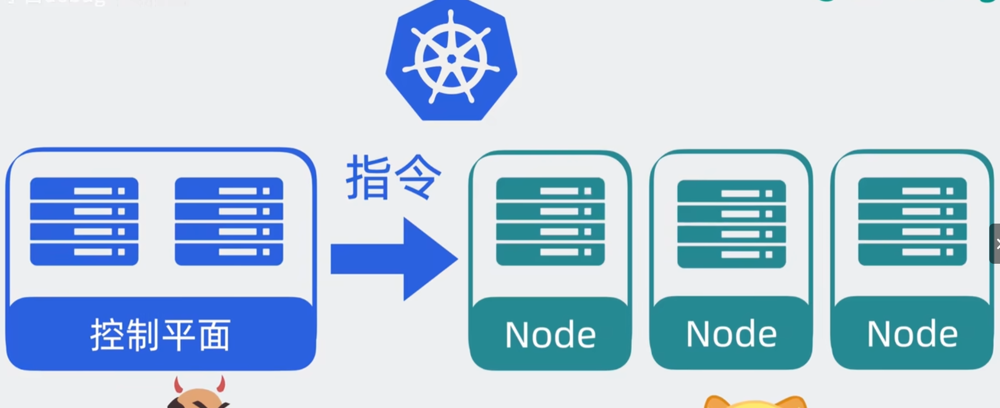
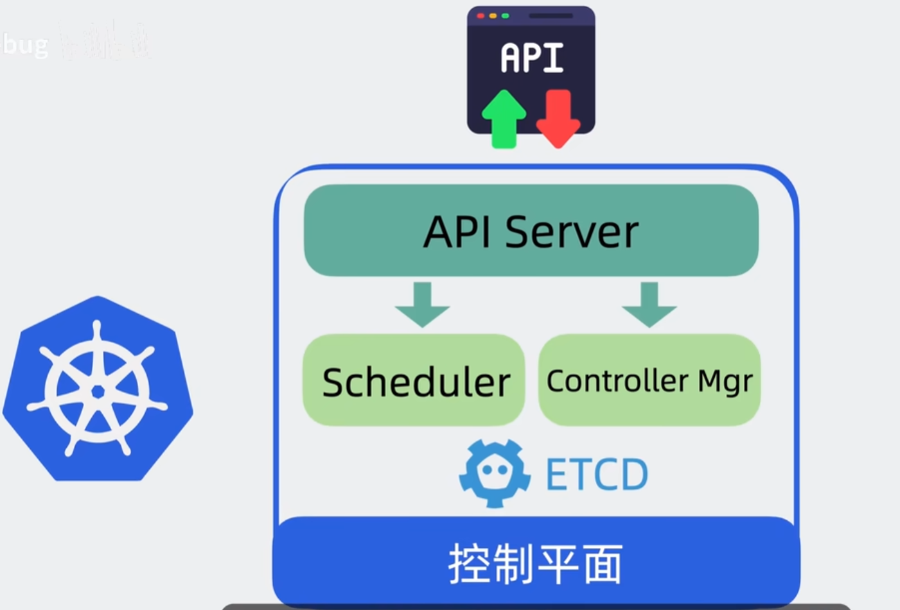
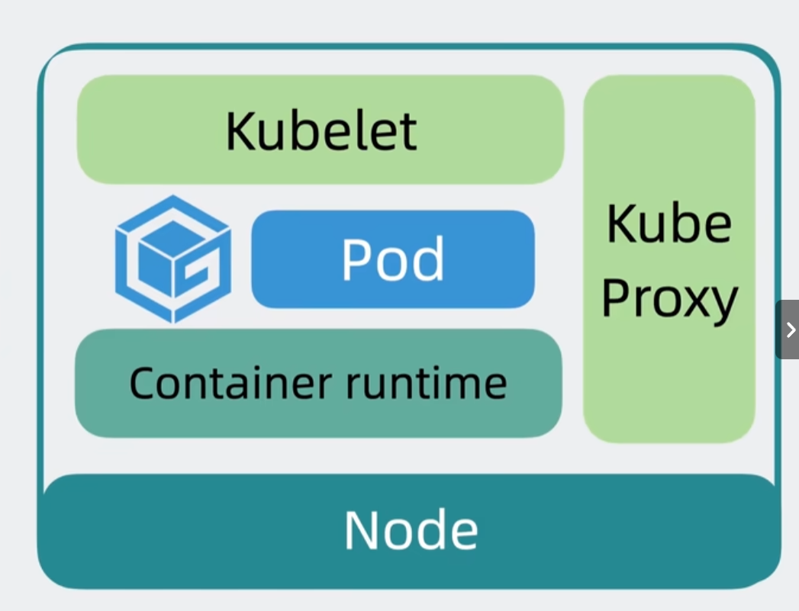
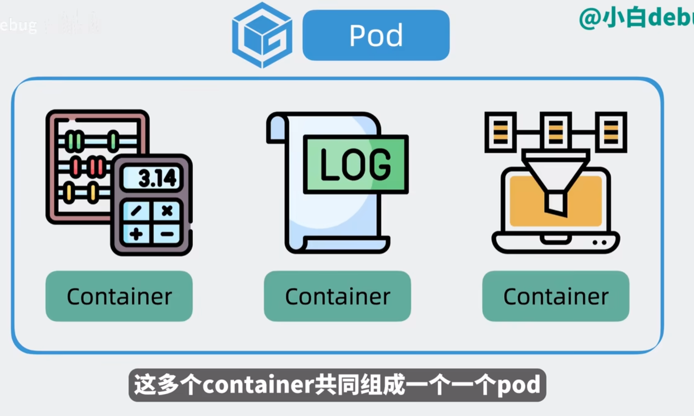
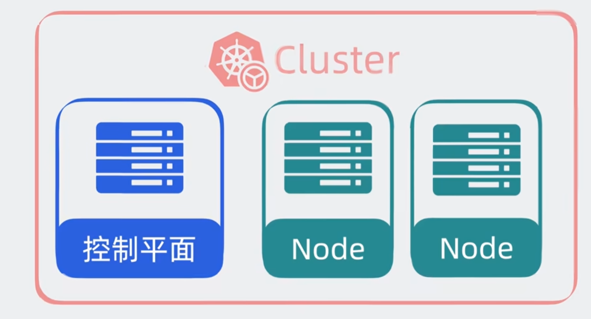

# Kubernetes 学习笔记

## 1. 什么是 Kubernetes？

* **Kubernetes (K8s)** 是一个开源的容器编排平台，用于自动化容器化应用的 **部署、扩展和管理**。
* 最初由 Google 开发，后来捐赠给 CNCF（Cloud Native Computing Foundation）。
* 解决了 Docker 只提供单机容器运行的问题，提供了 **集群管理** 能力。

---

## 2. Kubernetes 架构原理

K8s 是一个 **主从（Master-Node）架构**：

### 2.1 控制平面（Control Plane）

负责整个集群的调度与管理。

* **API Server**：集群的入口，所有操作通过它的 REST API。
* **etcd**：键值数据库，用于存储集群状态。
* **Controller Manager**：负责控制器逻辑，如副本数维护、节点管理等。
* **Scheduler**：负责 Pod 的调度（选择在哪个 Node 上运行）。

### 2.2 工作节点（Worker Node）

负责运行实际应用。

* **Kubelet**：每个节点的代理，负责和 API Server 通信，管理容器生命周期。
* **Kube-proxy**：实现服务发现和负载均衡，维护网络规则。
* **Container Runtime**：容器运行时（Docker、containerd、CRI-O）。

### 2.3 架构图（简化）

```
            [ Control Plane ]
   +----------------------------------+
   |  API Server | etcd | Scheduler   |
   |  Controller Manager              |
   +----------------------------------+

             |            |
         ----+------------+-----
             |            |
        [ Worker Node ]   [ Worker Node ]
   +-------------------+  +-------------------+
   | Kubelet | Proxy   |  | Kubelet | Proxy   |
   | Container Runtime |  | Container Runtime |
   +-------------------+  +-------------------+
```

---

## 3. Kubernetes 核心概念

### 3.1 Pod

* 最小的部署单元，可以包含一个或多个容器（共享网络和存储）。
* 生命周期短暂，经常被销毁和重新创建。


### 3.2 Cluster

定义：一个 Kubernetes 集群 就是一组运行着 Kubernetes 的机器（节点 Node），它们共同组成一个分布式系统。
组成部分：
* Master 节点（控制平面 Control Plane）：负责调度、API 管理、状态维护（相当于大脑）。
* Worker 节点（工作节点 Node）：真正运行容器的地方。

### 3.3 ReplicaSet

* 确保某个 Pod 副本数始终保持在预期数量。
* 如果 Pod 崩溃，会自动拉起新的。

### 3.4 Deployment

* 更高级的控制器，用于声明式更新应用。
* 支持版本回滚、滚动更新。

### 3.5 Service

* 稳定的网络访问入口，解决 Pod IP 动态变化的问题。
* 类型：

  * **ClusterIP**：集群内部访问。
  * **NodePort**：通过节点 IP\:Port 访问。
  * **LoadBalancer**：云厂商提供的外部负载均衡。

### 3.6 ConfigMap & Secret

* **ConfigMap**：存放配置（如环境变量、配置文件）。
* **Secret**：存放敏感数据（如密码、证书）。

### 3.7 Volume

* 数据存储抽象，用于持久化存储。
* 支持 NFS、云存储（EBS、GCE Persistent Disk）、本地存储等。

### 3.8 Namespace

* 集群的逻辑隔离单位，用于多租户或资源划分。

---

## 4. Kubernetes YAML 配置

K8s 使用 **YAML 文件** 声明资源对象（声明式管理）。

### 4.1 Pod 示例

```yaml
apiVersion: v1
kind: Pod
metadata:
  name: my-pod
  labels:
    app: myapp
spec:
  containers:
    - name: my-container
      image: nginx:latest
      ports:
        - containerPort: 80
```

### 4.2 Deployment 示例

```yaml
apiVersion: apps/v1
kind: Deployment
metadata:
  name: my-deployment
spec:
  replicas: 3   # 副本数
  selector:
    matchLabels:
      app: myapp
  template:
    metadata:
      labels:
        app: myapp
    spec:
      containers:
      - name: nginx
        image: nginx:1.25
        ports:
        - containerPort: 80
```

### 4.3 Service 示例

```yaml
apiVersion: v1
kind: Service
metadata:
  name: my-service
spec:
  type: NodePort
  selector:
    app: myapp
  ports:
    - port: 80       # Service 端口
      targetPort: 80 # Pod 容器端口
      nodePort: 30080 # 节点端口
```

---

## 5. Kubernetes 常用命令
kubectl 是 Kubernetes 的命令行工具，用来与 Kubernetes 集群交互。
就像 git 对应 Git 仓库，kubectl 对应的就是 Kubernetes API Server。

```bash
# 查看集群信息
kubectl cluster-info

# 查看节点
kubectl get nodes

# 查看所有 Pod
kubectl get pods -A

# 应用配置
kubectl apply -f deployment.yaml

# 删除资源
kubectl delete -f deployment.yaml

# 查看 Pod 详细信息
kubectl describe pod my-pod

# 进入容器
kubectl exec -it my-pod -- /bin/bash

# 查看日志
kubectl logs my-pod
```

---

## 6. Kubernetes 部署方式

* **minikube**：本地单机集群，适合学习。
* **kind**（Kubernetes in Docker）：使用 Docker 启动 K8s 集群。
* **云原生平台**：

  * GKE（Google）
  * EKS（AWS）
  * AKS（Azure）
* **生产环境**：kubeadm、Rancher、OpenShift 等。

---

## 7. Kubernetes 与 Docker 的关系

* Docker：负责 **单机容器运行**。
* Kubernetes：负责 **容器编排和集群管理**。
* K8s 使用 **Container Runtime Interface (CRI)**，不仅支持 Docker，还支持 **containerd**、**CRI-O**。
* 2020 年后，K8s 官方宣布移除 Docker 作为默认运行时，但 Docker 依旧可以使用（通过 containerd）。

---

## 8. Kubernetes 与 Docker Swarm 的区别

* **Docker Swarm**

  * Docker 自带的编排工具，简单易用。
  * 功能有限，社区热度下降。
* **Kubernetes**

  * 功能强大（自动伸缩、服务发现、滚动更新等）。
  * 复杂度更高，但已成为业界标准。