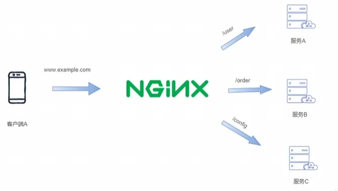

好的 👍 我帮你整理一篇 **关于 Nginx 的技术博客**，内容结构清晰，适合直接放到 VitePress 或者其他技术博客平台中。以下内容会涵盖基础概念、常见应用场景、核心配置解析，以及性能优化与实践。

---

# Nginx 技术博客

## 一、Nginx 简介

Nginx（发音 *engine x*）是一个高性能的 **HTTP 服务器**、**反向代理服务器**、**负载均衡器** 和 **邮件代理服务器**。
它由俄罗斯的 Igor Sysoev 于 2004 年开发，并因其 **高并发处理能力**、**低内存消耗** 和 **强大的扩展性**，在全球范围内被广泛使用。

与 Apache 相比，Nginx 更适合高并发场景。根据官方统计，Nginx 能够轻松支撑数十万并发连接，因此被大量互联网公司选用。

---

## 二、核心概念

在深入使用之前，先理解几个关键概念：

### 1. 正向代理与反向代理

* **正向代理**：代理客户端访问外部资源，例如翻墙代理。

* **反向代理**：代理服务器端，将外部请求转发到内部服务器，Nginx 就常用于反向代理。

### 2. 负载均衡

Nginx 可以将请求分发到多台后端服务器，实现：

* **轮询（Round Robin）**
* **最少连接（Least Connections）**
* **IP Hash（基于客户端 IP 固定分配）**

### 3. 静态资源服务

Nginx 能直接处理 HTML、CSS、JS、图片、视频等静态文件，性能远超 Node.js / Python 等应用服务器。

---

## 三、Nginx 配置文件结构

Nginx 的主配置文件通常是 `nginx.conf`，其基本结构如下：

```nginx
# 全局配置
worker_processes  4;

events {
    worker_connections  1024;
}

http {
    include       mime.types;
    default_type  application/octet-stream;

    sendfile        on;
    keepalive_timeout  65;

    # 服务器块
    server {
        listen       80;
        server_name  example.com;

        location / {
            root   /usr/share/nginx/html;
            index  index.html index.htm;
        }

        # 反向代理配置
        location /api/ {
            proxy_pass http://127.0.0.1:3000;
        }
    }
}
```

### 配置解析：

* **全局块**：定义工作进程数量、日志路径等。
* **events 块**：处理连接的相关配置。
* **http 块**：核心配置，包括 MIME 类型、日志、gzip 压缩、虚拟主机等。
* **server 块**：定义一个虚拟主机，可以有多个 server。
* **location 块**：具体的请求匹配规则。

---

## 四、常见应用场景

### 1. 静态资源服务器

```nginx
server {
    listen 80;
    server_name static.example.com;

    location / {
        root /var/www/static;
        index index.html;
    }
}
```

### 2. 反向代理

```nginx
location /api/ {
    proxy_pass http://127.0.0.1:5000;
    proxy_set_header Host $host;
    proxy_set_header X-Real-IP $remote_addr;
}
```

### 3. 负载均衡

```nginx
upstream backend {
    server 127.0.0.1:8080;
    server 127.0.0.1:8081;
    server 127.0.0.1:8082;
}

server {
    listen 80;

    location / {
        proxy_pass http://backend;
    }
}
```

### 4. HTTPS 配置（SSL 证书）

```nginx
server {
    listen 443 ssl;
    server_name example.com;

    ssl_certificate     /etc/nginx/ssl/example.crt;
    ssl_certificate_key /etc/nginx/ssl/example.key;

    location / {
        root /var/www/html;
        index index.html;
    }
}
```

---

## 五、性能优化实践

Nginx 的性能优化可以从以下几个方面入手：

1. **连接优化**

   ```nginx
   worker_processes auto;
   worker_connections 4096;
   multi_accept on;
   ```

2. **开启 Gzip 压缩**

   ```nginx
   gzip on;
   gzip_types text/plain text/css application/json application/javascript;
   gzip_min_length 1k;
   ```

3. **缓存配置**

   ```nginx
   location ~* \.(jpg|jpeg|png|gif|ico|css|js)$ {
       expires 30d;
       add_header Cache-Control "public";
   }
   ```

4. **HTTP/2 支持**

   ```nginx
   listen 443 ssl http2;
   ```

5. **反向代理缓存**

   ```nginx
   proxy_cache_path /var/cache/nginx levels=1:2 keys_zone=my_cache:10m;
   location /api/ {
       proxy_cache my_cache;
       proxy_pass http://127.0.0.1:5000;
   }
   ```

---

## 六、Nginx 与 DevOps

Nginx 在 DevOps 场景中常作为：

* **前端静态资源服务器**
* **微服务网关**
* **Docker / Kubernetes Ingress Controller**
* **CI/CD 部署后流量调度的核心组件**

---
